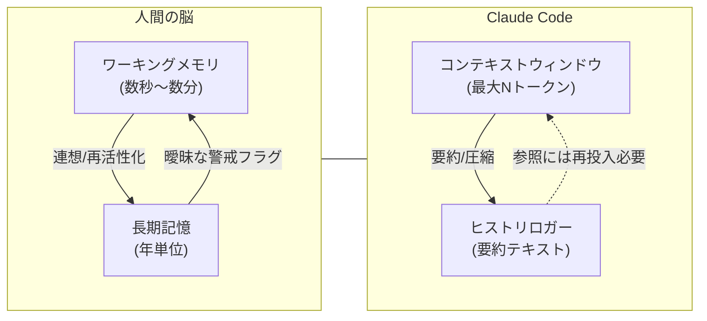

# Claude Code を \$3500 使って感じた「人間の脳」と「Claude Code の脳」の違い

## はじめに

> **本稿は ChatGPT o3 の支援を受けて執筆・整理しています。**
> Claude Code を \$3500 分以上使い倒した結果、人間の脳と Claude Code（AI エージェントとしての推論構造）の根本的な違いが徐々に見えてきました。このドキュメントでは、**コンテキストウィンドウ**を焦点に、両者の「脳の使い方」の差を図解とともに解説します。
> （2025 年 7 月現在の挙動をベースにしています）

---

## 1. 対応中のコンテキストウィンドウ内において

### 1.1 論理的一貫性の高さ

* Claude Code は **同一セッション内に保持されているトークン**（≒短期記憶）の範囲であれば、
  人間以上に構文・因果・定義の整合性を保ったアウトプットを返せる

  * 例：定義済みの関数仕様や変数名を誤用しない、整合チェックの手戻りが少ない
* これは「Attention が届く範囲＝コンテキストウィンドウ」を丸ごと SAT（静的解析）にかけているイメージ

### 1.2 コンテキストウィンドウの限界と圧縮（Compact）

* ところが **作業が長期化**するとすぐにウィンドウ上限（数十万トークン）に到達

  * 対応策として「要約」「回顧録」「スレッドの整理」などの **圧縮フェーズ** が必須
* 圧縮はどうしても情報の脱落・抽象化を招き、**前提の細部が失われる→推論品質が揺らぐ**

  * 例：過去の API 仕様変更を要約時に落としてしまい、以降の回答が古いまま

---

## 2. コンテキストウィンドウ外（長期スパン）での差異

| 観点              | 人間の脳                                       | Claude Code                              |
| --------------- | ------------------------------------------ | ---------------------------------------- |
| **うっすらとした関連付け** | “あれ？ 前にも似たバグを修正した気が…” といった **曖昧な連想を常時キープ** | ウィンドウ外は **ほぼ零参照**。関連を思い出すには明示的に再投入するしかない |
| **懸念・注意フラグ**    | 無意識下で「このライブラリは脆弱性が多いので要注意」等を保管             | 再提示しない限り忘却。圧縮後に欠落することもしばしば               |
| **メタ認知的監視**     | “集中しすぎて他タスクを忘れてないか？”という **セルフモニタリング** が働く  | ウィンドウの端以外は見えないため、**タスク脱線の自覚が遅い**         |

> **要点**：現行の Claude Code は「トークン化した明示的テキスト」を与えられて初めて参照できる。
> それ以外の“うっすらした脳裏の小骨”は保持できず、そこに人間との差が残る。

### 2.1 一時的リロード効果（仮忘却と再活性化）

* Claude Code はウィンドウ外の情報を完全に失っているわけではなく、\*\*関連するキーワードを再提示すると、その周辺知識を“ダウンロードし直す”\*\*かのように迅速に復元する挙動がある
* 実務では *「◯月◯日の〇〇 API 仕様変更を覚えてる？」* と聞くだけで精度が急回復する場合が多い
* この性質を活かし、**重要イベントを思い出させるリマインドプロンプト**を定期的に挿入すると効率が上がる

### 2.2 記憶の曖昧化と「雰囲気コーディング」

* 直近触れていない仕様は **記憶のエッジが丸まり、曖昧化** する

  * 似た意味の関数名やデータベースカラムを“雰囲気”で呼び出し、整合性チェックを怠る傾向
* 人間なら IDE やテストで即座に気付き修正するが、Claude Code は **実行環境が無いため誤りに気付きにくい**
* 対策：**単体テストケースや正解例の再提示**で認識をリフレッシュし、曖昧化を抑制する

### 2.2 意図推測と文化的共有度

* Claude Code は UI 変更など **明示的に指示していない背景理由** を、まるで「当てに行く」かのように推測して示すことが稀にある。

  * 例：ボタン色変更を頼んだだけなのに「ユーザが誤タップしないようコントラストを高めたいのですね？」と回答
* この現象は **コンテキスト上の確率論的推測** と捉えられる。

  * 人間と AI が共有するドメイン知識・文化コードが一致するほど高確率で的中する
  * 逆に文化的ギャップが大きい場合は誤読・曲解が起きやすい
* 人間同士のコミュニケーションでも **文化共有度** が意図伝達の精度に直結するため、AI と人間の "脳" の仕組みは想像以上に相似形の可能性がある。

## 3. 図解：コンテキストと記憶のイメージ 図解：コンテキストと記憶のイメージ. 図解：コンテキストと記憶のイメージ

---

## 4. Claude Code を活かすメンタルモデル

1. **“上限に近い”を常にメトリクス化**

   * トークン残量を UI で可視化する／定期的に `token_usage()` を問い合わせる
2. **意図的なメモリピン留め**

   * 重要仕様や判断基準は *冒頭リマインダー* に毎回貼り付け
3. **定期スナップショット & 要約レビュー**

   * 圧縮前に「失ったら困る詳細」を抜き出し、要約後の差分を検査
4. **“曖昧な懸念”はテキスト化して渡す**

   * 「心配していることリスト」という章を作り、随時追記・再提示

